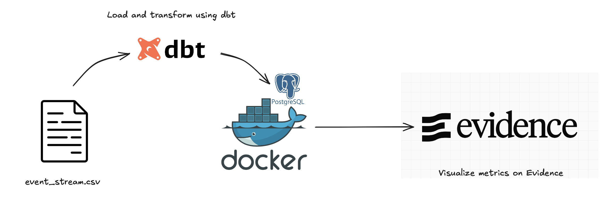
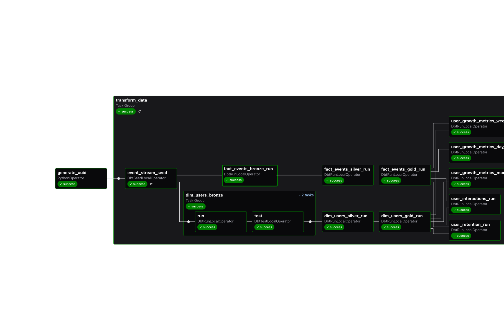
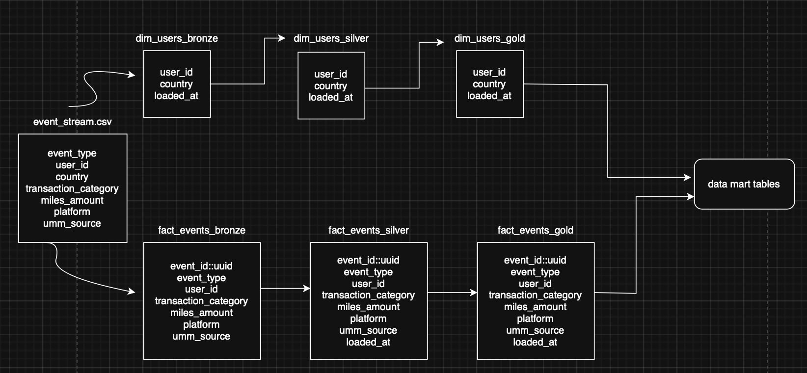
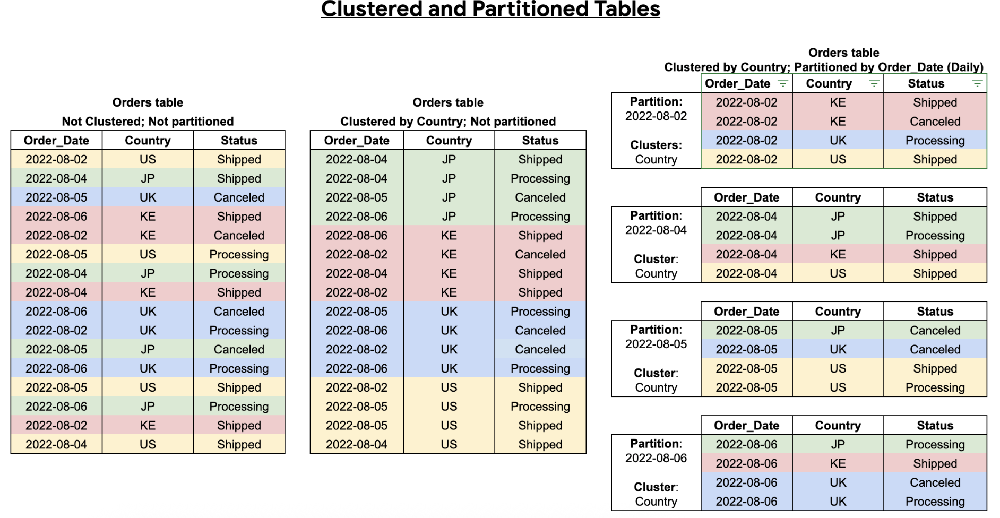
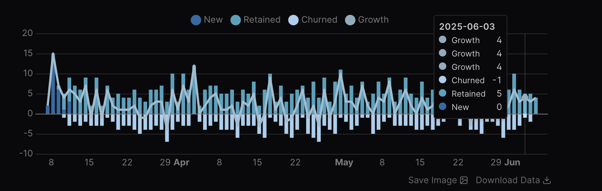

# The Flow


# Getting started
1. Clone the repo by running `git clone https://github.com/rainycow/heymax.git`
2. Create a virtual enviroment `python -m venv <env_name>`
3. Activate virtual environment by running `source <env_name>/bin/activate`
4. Install the required packages `pip install requirements.txt`

# Setting up PostgreSQL
## Using dbt

1. Spin up a postgres container.
```bash
cd dbt
docker compose up --build
```
2. Run the following commands to create the bronze, silver, gold and data mart tables.

```bash
dbt seed # load event_steam.csv into postgres
dbt build # dbt run to create the tables + dbt test to run expectations
```


## Using Airflow
1. Start Airflow.
```bash
cd airflow
astro dev start
```

2. In the Airflow UI, go to Admin -> Connections and click +.

3. Create a new connection. 
- Connection ID: *db_conn*.
- Connection Type: postgres
- Host: postgres
- Schema: public
- Login: postgres
- Password: Your Postgres password.
- Port: Your Postgres port.

4. Run the DAG by clicking "Trigger" and view the DAG in the graph view. Double click the task groups in order to expand them and see all tasks.



5. To stop the Airflow instance, run `astro dev stop` followed by `astro dev kill`.


# Spin up Evidence
Metrics are presented in [Evidence](https://evidence.dev). 

## In local environment
To start Evidence in your local environment, run the following commands.
```bash
cd reports
npm run sources
npm run dev
```

This will open a [browser](http://localhost:3000).

## As part of Airflow DAG
Evidence can also be hosted using GitHub Pages via GitHub Actions.
To run the pipeline as a series of tasks from data transformation to refreshing the dashboard, check out the branch `feat/refresh-evidence`, spin up Airflow and triggers the dag on the UI.

```bash
git checkout feat/refresh-evidence
cd airflow
astro dev start
````

The dashboard is hosted [here](https://rainycow.github.io/heymax/).

# The Data Model



## Bronze layer
Raw data from source is saved as-is in the bronze layer. Data is always fresh in this layer.
`event_id` is created as a surrogate key in `fact_events_bronze` as there is no natural primary key.
A column named `loaded_at` is also added. This column allows for incremental update to the tables in the subsequent layers.


## Silver layer
We keep a historical record of data in the silver layer. Data is continuously appended from the bronze layer to ensure a complete audit trail and enable users to track how data has changed over time.


## Gold layer
This is the source of truth and reflects the most up-to-date data. Tables in this layer will be used to create data marts for reporting and dashboarding.


## Data mart layer
This layer contains curated tables optimized for dashboards and reporting. Pre-joining and aggregating data in this layer enhances the performance of BI tools by reducing the need for on-the-fly computations.


# Design decisions

## Tests
### Data quality tests
Data quality tests or expectations help us to discover data quality issues before they cause problems downstream. More complex tests can be found on `dbt_expectations`.

### Unit tests
When classes are built in Python, use `pytest` or `unittest` to ensure that they work as expected.

## Improving pipeline robustness
In Airflow, there are also ways to gracefully handle failures before the pipeline is triggered or completed. For example, when you are downloading an object from S3, you can use the `S3KeySensor` to check for presence of the object before triggering the dag.

You can also configure notifications using `Notifier` in Airflow to notify data owners on dag failure.

## Scaling
When we're operating in a distributed cloud environment, we also have to think about disaster recovery. This means introducing redundancy in our data storage by taking snapshots of our dwh and replicate it in a different availability zone.

Scaling a db or dwh in the cloud usually involves:
- Vertical scaling: Upgrading to more powerful VMs
- Horizontal scaling: Adding more VMs 
- Hybrid scaling: Combining both approaches

In addition to compute scaling, table partitioning (usually by date) and column-based clustering are also ways to improve query performance and reduce costs by preventing full table scans.




## Materialized views
Materialized views are precomputed views that periodically store the results of a SQL query. This process is performed incrementally by using only the changed data in the base table. They are precomputed in the background without any user action and are useful in the computation of data mart tables that depends on the gold tables. 


## Redundancy and resilience
In distributed cloud environments, disaster recovery is critical. This includes:
- Automated snapshots of the data warehouse
- Cross-region/zone replication to ensure high availability and recovery from failures
- Data lifecycle management


## Dashboarding
Currently, Evidence offers a limited selection of chart types and customization options. While I chose it for its ease of setup, the dashboards could be significantly improved by using a more flexible and feature-rich visualization tool. For example, it was almost impossible to create a chart that pulls data from more than 1 table..



*Couldn't render this chart because the tooltip was wonky and there was no way to fix it other than delving into the javascript component*

